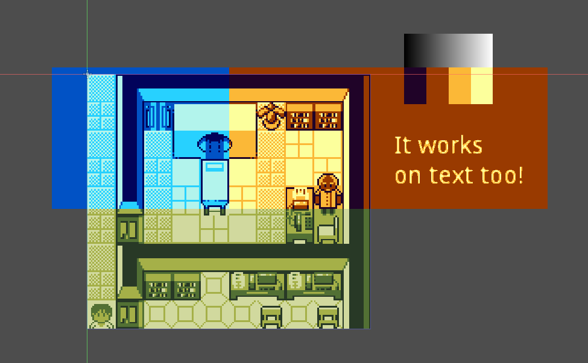
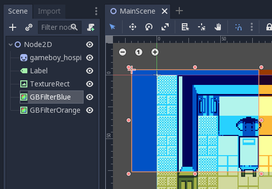
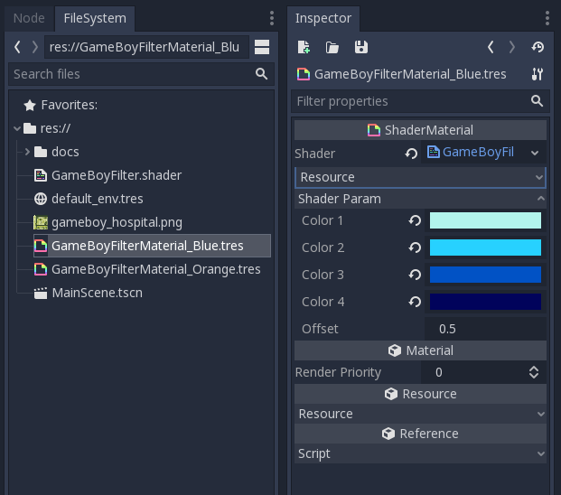

# Godot Gameboy Color Swap # 

This is a variant of Ivan Skodje's [Godot Gameboy Shaders](https://github.com/ivanskodje-godotengine/godot-gameboy-shaders). The code for the shader was updated to Godot v3.1.1. 

With this shader, you can color in images (or swap the palette) to look like they are displayed on a GameBoy. 

## Overview ## 

In the upper image, there is a screenshot of an imaginary game called "GameBoy Hospital". On the top left, there is a blue filter applied. On the top right, there is an orange filter applied. 

## Example ## 

 

As filter lens, there is a `ColoreRect` with a `GameBoyFilterMaterial_Blue.tres` set as material. Set it to the bottom of the scene hierarchy at top level, so the effects gets drawn on top. 

 

To create different filters, simply create new `ShaderMaterial`s with the shader assigned to them. In the inspector, you can then set the color palette under `Shader Param`. 

## How does it work? ## 

The `GameBoyFilter.shader` calculates the average gray tone for each pixel. Then, if its under the specified threshold, the corresponding color is being set. This works, because the shader gets the pixels from the `SCREEN_TEXTURE` itself - this means the pixels behind the ColorRect.  

## Licence ## 

MIT License (MIT)

**Copyright (c) 2016 Ivan P. Skodje**

Permission is hereby granted, free of charge, to any person obtaining a copy of this software and associated documentation files (the "Software"), to deal in the Software without restriction, including without limitation the rights to use, copy, modify, merge, publish, distribute, sublicense, and/or sell copies of the Software, and to permit persons to whom the Software is furnished to do so, subject to the following conditions:

The above copyright notice and this permission notice shall be included in all copies or substantial portions of the Software.

**Copyright (c) 2019 Lukas M. Semmler**

Permission is hereby granted, free of charge, to any person obtaining a copy of this software and associated documentation files (the "Software"), to deal in the Software without restriction, including without limitation the rights to use, copy, modify, merge, publish, distribute, sublicense, and/or sell copies of the Software, and to permit persons to whom the Software is furnished to do so, subject to the following conditions:

The above copyright notice and this permission notice shall be included in all copies or substantial portions of the Software.

THE SOFTWARE IS PROVIDED "AS IS", WITHOUT WARRANTY OF ANY KIND, EXPRESS OR IMPLIED, INCLUDING BUT NOT LIMITED TO THE WARRANTIES OF MERCHANTABILITY, FITNESS FOR A PARTICULAR PURPOSE AND NONINFRINGEMENT. IN NO EVENT SHALL THE AUTHORS OR COPYRIGHT HOLDERS BE LIABLE FOR ANY CLAIM, DAMAGES OR OTHER LIABILITY, WHETHER IN AN ACTION OF CONTRACT, TORT OR OTHERWISE, ARISING FROM, OUT OF OR IN CONNECTION WITH THE SOFTWARE OR THE USE OR OTHER DEALINGS IN THE SOFTWARE.